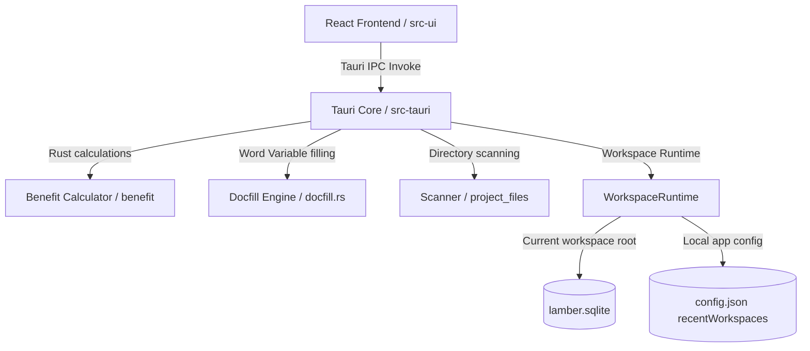

# ARCHITECTURE_MAP.md

Last updated: 2026-05-28

## 1. Repository overview

Lamber is a desktop application powered by **Tauri** (version 2). The architecture is divided into a Rust-based backend that handles heavy calculations, file parsing, and template replacements, and a React + TypeScript frontend that handles user interaction and layout rendering.

## 2. Directory map

### `src-tauri/...` (Rust Backend)
- **`src/main.rs`**: Entry point. Sets up plugins (dialog, http), initializes state managers, and registers Tauri command handlers.
- **`src/config_manager.rs`**: Manages the application workspace configurations.
- **`src/workspace.rs`**: Manages Lamber Workspace manifests, recent workspaces, last workspace restore, workspace readiness checks, and the active SQLite connection.
- **`src/db.rs`**: SQLite initialization, table creation, and schema version management.
- **`src/migration.rs`**: JSON-to-SQLite transactional database migration service and Tauri commands.
- **`src/docfill.rs`**: Extract variables from Word `.docx` zip packages and fills templates.
- **`src/benefit/`**: Benefit analysis engine.
  - [calculator.rs](file:///d:/HermesJang/CMCC/tools/lambert/lamber/src-tauri/src/benefit/calculator.rs): Computes 10-year cashflows, NPV, NPV rates, and margin rates.
  - [excel.rs](file:///d:/HermesJang/CMCC/tools/lambert/lamber/src-tauri/src/benefit/excel.rs): Generates template Excels and parses imported sheets.
  - [service.rs](file:///d:/HermesJang/CMCC/tools/lambert/lamber/src-tauri/src/benefit/service.rs): Manages Project lifecycle actions, risk levels, Schemes, and Snapshots.
  - [repository.rs](file:///d:/HermesJang/CMCC/tools/lambert/lamber/src-tauri/src/benefit/repository.rs): Handles JSON reads/writes and SQLite queries via dynamic repository backend.
  - [models.rs](file:///d:/HermesJang/CMCC/tools/lambert/lamber/src-tauri/src/benefit/models.rs): Rust data structures corresponding to frontend types.
- **`src/project_files/`**: Local folders and documents scanner.
  - [scanner.rs](file:///d:/HermesJang/CMCC/tools/lambert/lamber/src-tauri/src/project_files/scanner.rs): Scans directories recursively for Word, Excel, PDF, PPT, and Image files.
  - [service.rs](file:///d:/HermesJang/CMCC/tools/lambert/lamber/src-tauri/src/project_files/service.rs): Coordinates linked vs. copied file paths, binds project folders, and tracks scanning metadata.
  - [roots.rs](file:///d:/HermesJang/CMCC/tools/lambert/lamber/src-tauri/src/project_files/roots.rs): Global project roots configuration CRUD and default manager.
  - [health.rs](file:///d:/HermesJang/CMCC/tools/lambert/lamber/src-tauri/src/project_files/health.rs): Analyzes files existence, checks path links, and executes auto-healing.
  - [relocation.rs](file:///d:/HermesJang/CMCC/tools/lambert/lamber/src-tauri/src/project_files/relocation.rs): Performs transaction-wrapped bulk directories relocation.
  - [import_scanner.rs](file:///d:/HermesJang/CMCC/tools/lambert/lamber/src-tauri/src/project_files/import_scanner.rs): Recursively scans large folders to identify candidate projects and import them in database transactions.
  - [assets.rs](file:///d:/HermesJang/CMCC/tools/lambert/lamber/src-tauri/src/project_files/assets.rs): Manages project template assets in sandboxed sandbox directory (nesting inside bound project folder `{project_name}-图片/assets/` if linked, falling back to app data directory if rootless), verifies MIME/size constraints, handles soft deletes and orphan garbage collections.

### `src-ui/...` (Vite + React Frontend)
- **`src/main.tsx`**: Bootstraps the React application.
- **`src/App.tsx`**: Router matching `currentView` in Zustand.
- **`src/views/`**: Screen layouts.
  - [ProjectBoard.tsx](file:///d:/HermesJang/CMCC/tools/lambert/lamber/src-ui/src/views/ProjectBoard.tsx): Kanban lists, detail drawers, and candidate batch importer.
  - [IctLifecycle.tsx](file:///d:/HermesJang/CMCC/tools/lambert/lamber/src-ui/src/views/IctLifecycle.tsx): The main calculator workspace tabs.
  - [TemplateForms.tsx](file:///d:/HermesJang/CMCC/tools/lambert/lamber/src-ui/src/views/TemplateForms.tsx): Variable mapping and document filling triggers.
  - [BenefitTool.tsx](file:///d:/HermesJang/CMCC/tools/lambert/lamber/src-ui/src/views/BenefitTool.tsx): Standalone economic evaluation panel.
  - [DataManagement.tsx](file:///d:/HermesJang/CMCC/tools/lambert/lamber/src-ui/src/views/DataManagement.tsx): Data Management view containing Roots, Health Checker, and Relocator.
- **`src/store/`**: Zustand state management.
  - [useNavigationStore.ts](file:///d:/HermesJang/CMCC/tools/lambert/lamber/src-ui/src/store/useNavigationStore.ts): Navigation routing and tracking origin.
  - [useAiContextStore.ts](file:///d:/HermesJang/CMCC/tools/lambert/lamber/src-ui/src/store/useAiContextStore.ts): Local RAG workspace synchronization.
- **`src/components/`**: Modular UI components.
  - [IctBasicInfo.tsx](file:///d:/HermesJang/CMCC/tools/lambert/lamber/src-ui/src/components/IctBasicInfo.tsx): Project parameters form.
  - [IctCashflowTable.tsx](file:///d:/HermesJang/CMCC/tools/lambert/lamber/src-ui/src/components/IctCashflowTable.tsx): 10-year present value table.
  - [IctMetricsDashboard.tsx](file:///d:/HermesJang/CMCC/tools/lambert/lamber/src-ui/src/components/IctMetricsDashboard.tsx): Margin and NPV indicators overlay.
  - [ProjectFilesTab.tsx](file:///d:/HermesJang/CMCC/tools/lambert/lamber/src-ui/src/components/project/ProjectFilesTab.tsx): Handles file binding, scanning, and main doc marking in the Project Board drawer.
  - [AiChatPanel.tsx](file:///d:/HermesJang/CMCC/tools/lambert/lamber/src-ui/src/components/ai/AiChatPanel.tsx): The AI assistant drawer interface.

## 3. Main application flow

1. **Boot**: `main.rs` starts the Tauri runtime, loads local `config.json`, and attempts to restore `lastOpenedWorkspacePath`. It does not create or open an AppData primary database.
2. **Mount**: `main.tsx` mounts React. It queries `localStorage` to recover previous navigation states and active project choices.
3. **Routing**: `App.tsx` reads `currentView` from `useNavigationStore`. Toggling views changes the displayed view container.
4. **State Load**: If a workspace is ready and a project was active, `IctLifecycle.tsx` invokes `get_schemes` and `get_snapshots` against the current workspace database to restore calculations.

## 4. Core data flows

### 4.1 Project Board data flow
1. User creates a new project or edits a card on the board.
2. React invokes Tauri commands (`create_project_in_workspace` for creation, `update_project` for updates).
3. Rust Backend creates the standard project directories (`assets/`, `documents/`, `analyses/`), writes a redundant `project.json` manifest, saves project fields to the current workspace SQLite database, and returns the project entity.
4. The list is re-fetched and updated.

### 4.2 Project to Benefit Analysis flow
1. A project is associated with multiple `BenefitAnalysisScheme` records.
2. Each scheme has multiple versioned `BenefitAnalysisSnapshot` records (retaining the full JSON structure of inputs and outputs).
3. The latest snapshot's `inputParams` (containing core cashflow models, tax options, and project background) are serialized and back-filled into React states when launching the calculator.
4. The project's root record caches `summary_metrics` (margins, NPV, risk level) from the selected default scheme.

### 4.3 Funding model to Cashflow flow
1. Form edits are calculated in real-time or via manual trigger.
2. Input parameters (`IctInput` containing distributions) are calculated in [calculator.rs](file:///d:/HermesJang/CMCC/tools/lambert/lamber/src-tauri/src/benefit/calculator.rs).
3. Output results (`IctResult` with 10 cashflow row models containing PV, net cash, payback) are sent back to the frontend.
4. Toggling tabs to "10年现金流推演" renders the cashflow row objects.

### 4.4 AI Assistant context flow
1. User types in form fields or switches tabs.
2. Frontend triggers debounced (300ms) updates to `useAiContextStore` via `updateBusinessData`.
3. The store persists states to local storage and emits a Tauri event `lamber-ai-context-updated` to keep windows in sync.
4. On sending a chat message, [AiChatPanel.tsx](file:///d:/HermesJang/CMCC/tools/lambert/lamber/src-ui/src/components/ai/AiChatPanel.tsx) serializes active workspace scopes to Markdown, appends them to the system prompt, and pipes them to `AiRuntime.ts`.

### 4.5 File / Excel import flow
1. User clicks "一键导入" (Import Excel) on a parsed spreadsheet list item.
2. Frontend invokes `parse_benefit_excel(filePath)`.
3. Rust backend reads coordinates, determines matching formulas, and returns mapped financial parameters.
4. User confirms overwrite, which updates frontend states and triggers an automated recalculation.

## 5. State management map

- **Global View & Routing**: Managed by `useNavigationStore` (Zustand). Tracks:
  - `currentView`: (`hub`, `benefit`, `docfill`, `project_board`, `ict_lifecycle`).
  - `activeProjectId` / `activeSchemeId`: The focused project context.
  - `entrySource`: Remembers the previous view (Hub vs Project Board) to handle back-navigation.
- **RAG Context**: Managed by `useAiContextStore` (Zustand). Debounces workspace changes and shares states with LLM prompt builders.
- **Workspace State**: Managed by `useWorkspaceStore` and `WorkspaceRuntime`. Frontend tracks `currentWorkspace`, `workspaceRoot`, `workspaceName`, `workspaceId`, `recentWorkspaces`, and `isWorkspaceReady`.
- **Persistence Database**: Managed by the current workspace's `lamber.sqlite`. Project operations are blocked while no workspace is open.

## 6. Calculation engine map

All core math operations are located in `calculator.rs` under Tauri:
- **`calculate_ict_benefit`**: Computes IT/CT revenue/costs and simulated 10-year cashflows (using present values).
- **`reverse_calc_ict_target`**: Binary search to calculate the required IT integration cost to meet a target margin or NPV rate.
- **`reverse_calc_ict_revenue_target`**: Binary search to calculate the required IT integration revenue to meet a target margin or NPV rate.
- **`calculate_selection_fee`**: Bracket-based selection fee estimator.

## 7. UI system map

Following "The Architectural Ledger" specs in `DESIGN.md`:
- **Colors**: Hex tokens mapped in [DESIGN.md](file:///d:/HermesJang/CMCC/tools/lambert/lamber/DESIGN.md) (e.g. Primary `#285ab9`, Surface `#f9f9ff`).
- **No-border design**: Demarcate layout sections using tonal color differences (`bg-muted` vs `bg-card` vs `bg-white`) rather than solid border lines.
- **Typography**: Inter font with `font-variant-numeric: tabular-nums` for alignment of financial values.

## 8. Common task entry points

- **Modify Project Board columns or list layouts**: Start at [ProjectBoard.tsx](file:///d:/HermesJang/CMCC/tools/lambert/lamber/src-ui/src/views/ProjectBoard.tsx)
- **Change financial calculation values**: Start at [calculator.rs](file:///d:/HermesJang/CMCC/tools/lambert/lamber/src-tauri/src/benefit/calculator.rs)
- **Introduce new Document template parameters**: Start at [TemplateForms.tsx](file:///d:/HermesJang/CMCC/tools/lambert/lamber/src-ui/src/views/TemplateForms.tsx) and update variables mapping in [docfill.rs](file:///d:/HermesJang/CMCC/tools/lambert/lamber/src-tauri/src/docfill.rs).
- **Modify AI prompt behaviour or recommendation algorithms**: Start at [AiChatPanel.tsx](file:///d:/HermesJang/CMCC/tools/lambert/lamber/src-ui/src/components/ai/AiChatPanel.tsx).

## 9. Areas needing caution

- **Rounding alignment**: Javascript floats vs Rust Decimals. Keep inputs as strings or explicit Decimals to avoid minor fractions breaking the 0-tolerance reconciliation filter.
- **Excel Cell Coordinates mapping**: Cell offsets in `excel.rs` are strict. Ensure any changes in template design are reflected in Rust cell coordinates index mapping.
- **SQLite directory_id Foreign Key constraints**: If a project folder has no registered project root (running in absolute-only mode), its files' `directory_id` field must remain `NULL` (i.e. `None`). Only set `directory_id` to a valid directory ID if the folder is matched with a root, and ensure the corresponding row exists in `project_directories` to prevent `FOREIGN KEY constraint failed` database errors.
- **SQLite cascade deletes on INSERT OR REPLACE**: Avoid calling `INSERT OR REPLACE` to update existing records in parent tables (e.g. `projects` table) where child tables have `ON DELETE CASCADE` constraints (e.g. `project_directories`, `project_files`, `benefit_schemes`, `benefit_snapshots`). SQLite implements `REPLACE` as a delete-and-reinsert, which triggers cascades that delete all associated child rows. Use an existence check (`SELECT EXISTS`) followed by an `UPDATE` or `INSERT` instead.
