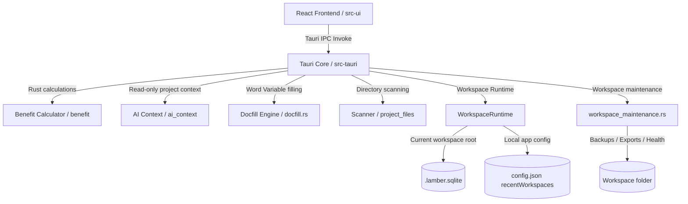

# ARCHITECTURE_MAP.md

Last updated: 2026-06-03 (ICT Subject-Level Funding Plans Phase 2)

## 1. Repository overview

Lamber is a desktop application powered by **Tauri** (version 2). The architecture is divided into a Rust-based backend that handles heavy calculations, file parsing, and template replacements, and a React + TypeScript frontend that handles user interaction and layout rendering.

## 2. Directory map

### `src-tauri/...` (Rust Backend)
- **`src/main.rs`**: Entry point. Sets up plugins (dialog, http), initializes state managers, and registers Tauri command handlers.
- **`src/config_manager.rs`**: Manages the application workspace configurations.
- **`src/workspace.rs`**: Manages Lamber Workspace manifests, recent workspaces, last workspace restore, workspace readiness checks, associated workspace unlinking, the active SQLite connection, and workspace initialization from existing plain directories with candidate subdirectories import.
- **`src/workspace_maintenance.rs`**: Provides workspace portability commands: daily/manual SQLite backup, backup restore with database connection release/reopen, `.lamber.zip` export/import/validation, read-only workspace health checks, repairable issue execution, external path listing, dry-run internal absolute path conversion, and native file-manager reveal.
- **`src/db.rs`**: SQLite initialization, table creation, and schema version management.
- **`src/migration.rs`**: JSON-to-SQLite transactional database migration service and Tauri commands.
- **`src/docfill.rs`**: Fills Word/Excel lifecycle templates for workspace-backed document generation.
- **`src/docfill.rs` lifecycle output rule**: `generate_lifecycle_docs` must resolve relative output folders against the active Workspace root, and may use the provided `projectId` to derive the project folder from Workspace SQLite when no explicit output directory is supplied. It must not write generated lifecycle documents into the Tauri process working directory.
- **`src/docfill.rs` image embedding rule**: Word image variables receive JSON payloads whose image entries should carry `assetId` values. The backend resolves those asset IDs through Workspace SQLite and embeds image binaries into `word/media`; frontend-only preview URLs must not be treated as document image data.
- **`src/docfill.rs` Excel subject-row mapping**: `internal_generate_xlsx` uses a unified mapping for all standard revenue/cost subjects in `3-直接经济效益评估表`. For each mapped subject row, the name cell receives the frontend-resolved display name from `ictSubjectCatalog.ts` (`计费科目名称 > 具体业务/产品名称 > 标准科目名称`), `G` receives tax-exclusive amount, and `Q` receives tax-inclusive amount. Empty/zero frontend amount inputs are written as blank cells rather than numeric `0`. No rows are inserted or deleted.
- **Sign-off and meeting-review investment wording**: `TemplateForms.tsx` builds `PROJECT_INVESTMENT_SITUATION` and `PROJECT_REVENUE_SITUATION` for the sign-off template by iterating `ICT_SUBJECT_DEFINITIONS`, selecting non-zero tax-exclusive subjects, and using billing subject names with standard-name fallback plus the fixed document prefix (`IT-`, `CT-`, `非IT/CT-`, `综合类-`). Meeting-review `PROJECT_TOTAL_INVESTMENT_DETAIL` / meeting `PROJECT_TOTAL_INVESTMENT` reuse the same generated investment wording so subject prefixes stay consistent. The sign-off template contains these full-line placeholders instead of hardcoded IT/CT-only wording, and the optional "申请立项后甄选" phrase is controlled by a form checkbox. `docfill.rs` also normalizes the old hardcoded sign-off wording to these placeholders during generation for compatibility with existing local templates.
- **`src/ai_context/`**: Read-only AI Project Context Service. It exposes `build_ai_project_context`, validates the project against the active workspace database, and summarizes persisted project overview, lifecycle, cashflow, benefit, template, and file metadata without writing data, reading full documents, or loading image binaries.
- **`src/ai_context/` template detail extension**: `build_ai_project_context` can load `template_detail` for a specified `activeTemplateId`, reading one saved template from `project_template_states` with legacy `project_settings` fallback. `load_ai_template_asset` validates `projectId + assetId` ownership and returns a temporary vision data URL only for explicitly selected template images.
- **`src/ai_context/` Workspace project index**: `list_ai_workspace_projects` returns a read-only lightweight index for the current Workspace, including project identity, status, updated time, saved lifecycle/cashflow/template/benefit existence flags, and saved template names. It never returns absolute paths, file contents, image bytes, or full template JSON.
- **`src/benefit/`**: Benefit analysis engine.
  - [calculator.rs](../src-tauri/src/benefit/calculator.rs): Computes 10-year cashflows, NPV, NPV rates, and margin rates.
  - [excel.rs](../src-tauri/src/benefit/excel.rs): Parses imported economic evaluation sheets and maps them into ICT lifecycle data.
  - [service.rs](../src-tauri/src/benefit/service.rs): Manages Project lifecycle actions, risk levels, Schemes, and Snapshots.
  - [repository.rs](../src-tauri/src/benefit/repository.rs): Handles JSON reads/writes and SQLite queries via dynamic repository backend.
  - [models.rs](../src-tauri/src/benefit/models.rs): Rust data structures corresponding to frontend types.
- **`src/project_files/`**: Local folders and documents scanner.
  - [scanner.rs](../src-tauri/src/project_files/scanner.rs): Scans directories recursively for Word, Excel, PDF, PPT, and Image files.
  - [service.rs](../src-tauri/src/project_files/service.rs): Coordinates linked vs. copied file paths, binds project folders, and tracks scanning metadata.
  - [roots.rs](../src-tauri/src/project_files/roots.rs): Global project roots configuration CRUD and default manager.
  - [health.rs](../src-tauri/src/project_files/health.rs): Analyzes files existence, checks path links, and executes auto-healing.
  - [relocation.rs](../src-tauri/src/project_files/relocation.rs): Performs transaction-wrapped bulk directories relocation.
  - [import_scanner.rs](../src-tauri/src/project_files/import_scanner.rs): Recursively scans large folders to identify candidate projects and import them in database transactions.
  - [assets.rs](../src-tauri/src/project_files/assets.rs): Manages project template assets in sandboxed sandbox directory (nesting inside bound project folder `{project_name}-图片/assets/` if linked, falling back to app data directory if rootless), verifies MIME/size constraints, handles soft deletes and orphan garbage collections.

### `src-ui/...` (Vite + React Frontend)
- **`src/main.tsx`**: Bootstraps the React application. Executes synchronous theme and scaling hydration on startup to prevent color flashes.
- **`src/App.tsx`**: Router matching `currentView` in Zustand.
- **`src/views/`**: Screen layouts.
  - [ProjectBoard.tsx](../src-ui/src/views/ProjectBoard.tsx): Kanban lists, detail drawers, and candidate batch importer. Incorporates system settings gear shortcut.
  - [IctLifecycle.tsx](../src-ui/src/views/IctLifecycle.tsx): The main calculator workspace tabs.
  - [TemplateForms.tsx](../src-ui/src/views/TemplateForms.tsx): Variable mapping, inquiry vendor quote rows/screenshots, and document filling triggers.
  - [DataManagement.tsx](../src-ui/src/views/DataManagement.tsx): Data Management view containing Roots, Health Checker, and Relocator.
- **`src/theme/`**: Theme specification tokens and runtime switcher:
  - [appearance.ts](../src-ui/src/theme/appearance.ts): Holds type definitions (extended with `ContrastPreference`, `CustomAccentSettings`), config version (v3), and DEFAULT_APPEARANCE_SETTINGS.
  - [presets.ts](../src-ui/src/theme/presets.ts): Holds the HSL light themes and refined HSL dark themes (`DARK_THEMES`) for the 5 presets, plus high contrast overrides.
  - [applyAppearance.ts](../src-ui/src/theme/applyAppearance.ts): Resolves final variables in sequence (Base preset -> Custom accent derivation -> High contrast overrides) and writes HSL colors, scaling ratios, and density settings to `document.documentElement` styles and attributes.
  - [colorUtils.ts](../src-ui/src/theme/colorUtils.ts): Custom RGB/HSL conversions, relative luminance calculations, and WCAG contrast ratio checkers.
  - [deriveAccentTokens.ts](../src-ui/src/theme/deriveAccentTokens.ts): Generates WCAG-compliant derived HSL accent tokens (`primary`, `primary-foreground`, `primary-soft`, `ring`, `accent`, `accent-foreground`) from custom colors using HSL lightness shifting.

- **`src/services/workspaceMaintenanceService.ts`**: Frontend IPC wrapper for workspace backup/restore/export/import/health/path maintenance commands.
- **`src/services/aiProjectContextService.ts`**: Typed frontend wrapper for `build_ai_project_context`, now used by the AI chat context composer during message send.
- **`src/lib/ictSubjectCatalog.ts`**: Fixed frontend catalog and shared presentation resolver for ICT billing subject identity. It maps stable `subjectCode`, UI group/key, standard subject name, Excel variable prefix, and document business prefix (`IT`, `CT`, `非IT/CT`, `综合类`) so product/business names and billing subject names remain separate from standard subject identity. `resolveBillingSubjectPresentation` centralizes Excel display names, document business names, and document dedup keys.
- **`src/lib/ictBalanceAllocation.ts`**: Shared frontend rule helper for ICT revenue/investment total balancing. It normalizes and serializes `revenue_balance_rule` / `investment_balance_rule`, resolves stable `subjectCode + groupId + key` subject references, computes inclusive-amount differences with existing two-decimal money behavior, and reports missing/negative validation states without writing financial amounts itself.
- **`src/lib/ictReverseCalculation.ts`**: Shared frontend helper for dynamic smart reverse calculation subjects. It builds eligible revenue/cost subject options from `ICT_SUBJECT_DEFINITIONS`, uses stable subject references (`side + subjectCode + groupId + key`), resolves display names through the shared subject resolver, applies candidate tax-inclusive amounts to arbitrary subject groups, mirrors the existing CT revenue-to-cost amount linkage, and resolves reverse modes (`normal`, `locked_total_structure`, `blocked`) for balance-allocation interactions.
- **`src/lib/ictSubjectFundingPlan.ts`**: Shared frontend helper for subject-level funding plan state. It binds plans to concrete subject instances through `side + groupId + key`, creates default upfront plans, builds cents-exact equal splits over 1-10 years, normalizes legacy/unknown payloads, updates custom annual values, validates annual tax-inclusive totals against subject inclusive amount, validates full calculation-source coverage, and builds yearly subject-plan cashflow arrays with per-subject/per-year tax conversion.
- **`src/ai/context/`**: AI chat context composer. It builds the per-message context bundle by reading the active project ID, loading saved official context from Workspace SQLite through `aiProjectContextService.ts`, and filtering the current frontend state into an unsaved draft overlay only when dirty scopes match the active project/page.
- **`src/ai/context/workspaceProjectRouter.ts`**: Deterministic Workspace project-name router used by the composer. It matches explicit project names against the current Workspace project index, limits deep official context loading to two specified projects per turn, resolves one specified template when uniquely named, and returns warnings for ambiguous or unresolved routing.
- **`src/ai/templateAssetSelection.ts`**: Cross-window event bridge for explicit template image analysis requests. It carries only template asset metadata (`projectId`, `templateId`, `assetId`, field label) and never carries physical file paths or image base64.
- **`src/store/`**: Zustand state management.
  - [useNavigationStore.ts](../src-ui/src/store/useNavigationStore.ts): Navigation routing and tracking origin. Incorporates return paths for temporary overlay settings.
  - [useAiContextStore.ts](../src-ui/src/store/useAiContextStore.ts): Local RAG workspace synchronization.
  - [useAppearanceStore.ts](../src-ui/src/store/useAppearanceStore.ts): Stores application-level appearance settings in `localStorage` and handles cross-window sync broadcasts via Tauri events.
- **`src/components/`**: Modular UI components.
  - [settings/SettingsView.tsx](../src-ui/src/components/settings/SettingsView.tsx): Screen panel enabling themePreset, colorMode, fontScale, and density selections, with a real-time preview card.
  - [IctBasicInfo.tsx](../src-ui/src/components/IctBasicInfo.tsx): Project parameters form.
  - [IctCashflowTable.tsx](../src-ui/src/components/IctCashflowTable.tsx): 10-year present value table.
  - [IctMetricsDashboard.tsx](../src-ui/src/components/IctMetricsDashboard.tsx): Margin and NPV indicators overlay.
  - [IctSubjectFundingPlanEditor.tsx](../src-ui/src/components/IctSubjectFundingPlanEditor.tsx): Inline editor for per-subject collection/payment plans. It edits 10-year tax-inclusive annual values, shows per-row consistency, and reflects whether the project currently uses legacy cashflow or subject-plan cashflow.
  - [ProjectFilesTab.tsx](../src-ui/src/components/project/ProjectFilesTab.tsx): Handles file binding, scanning, and main doc marking in the Project Board drawer.
  - [AiChatPanel.tsx](../src-ui/src/components/ai/AiChatPanel.tsx): The AI assistant drawer interface.
  - [IctSubjectRoleComponents.tsx](../src-ui/src/components/IctSubjectRoleComponents.tsx): UI components for subject role actions (SubjectRoleActions), summaries (SelectedSubjectRoleSummary), and smooth-scroll navigation (scrollToSubject, highlightSubjectElement).

## 3. Main application flow

1. **Boot**: `main.rs` starts the Tauri runtime, loads local `config.json`, and attempts to restore `lastOpenedWorkspacePath`. It does not create or open an AppData primary database.
2. **Mount**: `main.tsx` mounts React. It queries `localStorage` to recover previous navigation context (e.g. active project/scheme IDs) but always defaults the current view to `"hub"`.
3. **Routing**: `App.tsx` reads `currentView` from `useNavigationStore`. Toggling views changes the displayed view container.
4. **State Load**: If a workspace is ready and a project was active, `IctLifecycle.tsx` invokes `get_schemes` and `get_snapshots` against the current workspace database to restore calculations.

## 4. Core data flows

### 4.0 Domain save boundaries

Phase 3 introduces explicit project-state save domains:

- `projects`: project identity, board metadata, folder links, and summary metrics.
- `project_lifecycle_states`: current ICT lifecycle editor profile, parameters, background, and structured input payload.
- `project_cashflow_states`: current funding model, payment model, yearly cashflow, sector cashflow, assumptions, and metrics.
- `benefit_schemes` / `benefit_snapshots`: named benefit方案 metadata and historical calculation snapshots.
- `project_template_states`: template form field values, field mappings, template binding metadata, and output configuration.
- `project_template_assets`: file-backed template images/attachments and metadata.

ICT revenue/cost tax items may include optional `customSubjectName` / `billingSubjectName` on the frontend and `custom_subject_name` / `billing_subject_name` in serialized lifecycle/snapshot payloads. Amount calculations continue to read only `incl_tax` and `tax_rate`; both custom names are UI/document/Excel metadata and are ignored by financial formula paths. `project_cashflow_states.assumptions_json`, `project_lifecycle_states.input_payload_json`, and benefit snapshots preserve the optional fields for reload and export compatibility.

ICT balance allocation rules are stored as configuration, not as a second source of financial amounts. `useIctState.balanceAllocation` owns independent revenue and investment rules. `IctLifecycle.tsx` evaluates both sides through `ictBalanceAllocation.ts` and, when a rule is valid, applies the derived inclusive amount through `updateTaxItem(groupId, key, "incl", amount)`. This keeps formal subject amounts in the existing `TaxItem` structures consumed by cashflow, metrics, Excel/Word generation, and AI context. The rules are serialized in lifecycle input payloads as `revenue_balance_rule` / `investment_balance_rule` and in cashflow assumptions as `balanceAllocation`.

Frontend global save goes through `domainSaveService` and `useSaveStore` registered handlers. The save store does not read business component state directly; each mounted page registers the handler responsible for serializing its current local state.

Each save handler returns the dirty scopes it actually persisted. `useSaveStore.saveCurrentProject()` snapshots workspace/project/dirty scopes at save start, rejects unregistered scopes, keeps failed scopes dirty, and re-checks workspace/project before clearing anything. Template forms use the same store: ordinary autosave may clear `template-forms` after success, while Ctrl/Command+S and the global save button must receive a failing handler result if template state or asset-reference persistence fails.

### 4.0.1 Workspace portability maintenance flow

- Opening a workspace registers the active workspace root if needed and attempts one daily SQLite backup at `.backups/lamber-YYYY-MM-DD.sqlite`; backup failure is surfaced as a warning and must not block workspace opening.
- Manual backup runs `VACUUM INTO` to create `.backups/lamber-YYYY-MM-DD-HH-MM-SS.sqlite` and does not modify the live database.
- Backup list cleanup in `DataManagement.tsx` can delete individual backup files or clear the currently listed backups through `delete_workspace_backup`; it does not touch the live `.lamber.sqlite` database.
- Backup restore validates the selected SQLite backup, creates a pre-restore backup, closes the active `WorkspaceRuntime` database connection, replaces `.lamber.sqlite`, and reopens the current workspace. If replacement or reopen fails, it attempts to restore the original database and reopen it.
- Workspace export first creates a consistent SQLite backup copy, runs a lightweight health check, then writes a `.lamber.zip` whose root entries mirror the workspace root: `.lamber.workspace.json`, `.lamber.sqlite`, `.projects/`, project directories, and `export-manifest.json`. `.backups` and `.exports` are excluded by default.
- After export, the UI opens the archive's containing directory. Backend reveal still supports file selection, but Windows Explorer receives `/select,PATH` without embedded quotes to avoid falling back to the desktop when parsing the target path fails.
- Workspace import validates zip structure and zip-slip safety, supports direct-root archives and one-top-level wrapper archives, treats the user-selected folder as the parent destination, extracts into `{selectedFolder}/{workspaceName}` by default, preserves `workspaceId`, adds the imported path to recent workspaces, and optionally opens it immediately. Import IPC uses flat arguments (`openAfterImport`, `conflictStrategy`, `destinationName`) rather than a nested `options` payload. Frontend call sites pass explicit service arguments, and the backend normalizes `openAfterImport` from JSON; absent or malformed nested values default to `false` instead of aborting import.
- Data Management shows the local `recentWorkspaces` association list in a dedicated Workspace Management tab, using the same card-based selection pattern as the Project Board workspace picker. Users can open, reveal, or unlink remembered Workspaces. Unlinking removes only the local config entry; if the target is currently open, the frontend runs the dirty guard first and the backend clears the active Workspace runtime plus `lastOpenedWorkspacePath`.
- Workspace Management cards are local selection targets only. Clicking a card highlights it without opening the Workspace or updating `lastOpenedAt`; inline buttons perform explicit open/reveal/unlink actions and must stop propagation. The open action switches to the target Workspace and then navigates to the Project Board.
- `run_workspace_health_check` is read-only. File or database changes are restricted to explicit repair commands that create a database backup first.
- Existing-folder Workspace initialization commits project inserts, releases the SQLite lock, and returns the opened Workspace before project folder scans or automatic Excel import run in a background task. The background task captures the initialized workspace root and database handle so it does not depend on a later current-workspace lookup.
- Windows requires explicit Hidden file attributes for Workspace system entries. Backend workspace maintenance marks `.lamber.workspace.json`, `.lamber.sqlite`, `.backups`, `.exports`, and `.projects` hidden when those entries are created, imported, repaired, or opened.
- Project manifest repair regenerates `project.json` using the same project directory fallback that health checks use: `relative_path`, `linked_folder_relative_path`, `folder_path`, then `folder_name`.
- External module paths (`module_path:*`) can be repaired by resetting the module base directory to `.projects/modules/{moduleId}` inside the active Workspace. This updates app config and creates `templates/` / `output/`, but does not copy or delete files from the previous external location.
- Internal absolute path conversion is a dry-run by default. Applying conversion is a separate user-confirmed operation and does not rewrite external roots.

### 4.0.2 AI Project Context read flow

- Frontend callers use `buildAiProjectContext(request)` from `aiProjectContextService.ts`, passing `projectId`, optional `requestedSources`, and optional `activeTemplateId`.
- The Tauri command requires an active `WorkspaceRuntime` workspace and database connection. It never accepts workspace roots, database paths, or absolute asset paths from the frontend.
- The Rust service validates `projectId` in the current workspace database before loading any child state.
- The service performs only `SELECT` queries against `.lamber.sqlite`. Missing optional domain state returns `None` or warnings, while invalid JSON or database errors are returned as explicit failures.
- Default calls return lightweight summaries. Explicit `requestedSources` can request detailed lifecycle/cashflow JSON and file metadata, but templates remain summarized and file/image/document contents are not read.

### 4.0.3 AI chat composed context flow

- `AiChatPanel` calls `buildAiChatContext()` every time a message is sent, not only when the AI window opens.
- `buildAiChatContext()` derives the active project from existing navigation/project stores and refreshes the latest persisted navigation/current-project/ICT active project identity at send time so a separate AI window does not rely on stale in-memory Zustand state. If no active project-aware view/project exists, it does not call the project SQLite context command and emits only a lightweight warning node.
- Before falling back to the active project, the composer asks `list_ai_workspace_projects` for the current Workspace's lightweight project index and deterministically checks whether the current user message explicitly names one or two projects. Unique matches are routed to `build_ai_project_context` by real `projectId`; project names are not used as persistent keys.
- Explicitly named projects override the currently open project. Workspace-level list questions use the lightweight project index instead of defaulting to the active project. Named-project references that cannot be uniquely resolved do not fall back to another project.
- For specified project template questions, the composer first loads the target project's template summary, resolves a unique template name or known alias, then reuses `build_ai_project_context` with `requestedSources: ["templates", "template_detail"]` and the matched `activeTemplateId`.
- Workspace changes clear previous active project/scheme IDs from project, navigation, and legacy ICT local storage state before the new workspace is used for AI context lookup.
- Saved official project state is injected as `Saved Official Project State (Workspace SQLite)`.
- Specified project official state is injected as `Specified project saved official state (Workspace SQLite)` with the matched project name, real `projectId`, and resolution metadata. Multi-project comparison keeps each project's official context in a separate node.
- Project Board publishes a compact current-workspace summary (`workspaceId`, project count, and lightweight project cards) as current page context so workspace-level questions do not require selecting a project.
- Current frontend dirty page state is injected as `Current Unsaved Draft Overlay` only when `useSaveStore.dirtyScopes` contains scopes relevant to the current page and the draft payload is for the same project.
- When the user explicitly queries another project, the current page draft overlay is omitted unless the dirty draft belongs to one of the explicitly loaded projects.
- Draft overlay sanitation removes base64/data URL previews, omits absolute paths, truncates large strings/arrays/objects, and never reads image/document binaries.
- Context loading failures degrade into prompt warnings and do not break streaming, image input, message history, or runtime provider calls.
- Before a new assistant placeholder is inserted, `AiChatPanel` resets `useStreamingParser` and creates a fresh abort controller. During streaming, the last assistant message is overwritten from the parser's current `normalText` / `thinkText` values so old reply content cannot be carried into the new pending response.

### 4.0.4 AI template detail and vision asset flow

- `TemplateForms.tsx` publishes the current `selectedTemplate` and `projectId` into the template AI context payload, allowing the composer to identify the active template reliably after floating-window or template switching.
- When the active module is an ICT template context, `buildAiChatContext()` requests `template_detail` with `activeTemplateId`. The backend loads only that template's saved fields from Workspace SQLite and sanitizes base64/data URLs, preview fields, absolute local paths, and oversized content before returning it.
- Template dirty edits remain in `Current unsaved draft overlay`; they are not merged into saved official template detail.
- Image assets in template detail are metadata-only by default. The template UI adds an explicit "AI analysis" action on image thumbnails. Selecting it broadcasts only `projectId + templateId + assetId` metadata to the AI window.
- On send, `AiChatPanel` calls `load_ai_template_asset` for selected template-asset attachments. The command validates project ownership, supported image MIME type, size, and workspace-contained file resolution, then returns a temporary data URL for the existing `image_url` multimodal request path.
- Conversation history stores only text and lightweight attachment metadata for template assets; selected image base64 is not written back to SQLite or injected automatically in later turns.

### 4.1 Project Board data flow
1. User creates a new project or edits a card on the board.
2. React invokes Tauri commands (`create_project_in_workspace` for creation, `update_project` for updates).
3. Rust Backend creates the standard project directories (`assets/`, `documents/`, `analyses/`), writes a redundant `project.json` manifest, saves project fields to the current workspace SQLite database, and returns the project entity.
4. The list is re-fetched and updated.

### 4.2 Project to Benefit Analysis flow
1. A project is associated with multiple `BenefitAnalysisScheme` records.
2. Each scheme has multiple versioned `BenefitAnalysisSnapshot` records (retaining the full JSON structure of inputs and outputs).
3. When launching the calculator, current editor state from `project_lifecycle_states` is preferred over scheme snapshots so global save / Ctrl+S changes are restored even when a default scheme id is present. If no current lifecycle state exists, the latest snapshot's `inputParams` is used as compatibility fallback.
4. Cashflow-domain assumptions from `project_cashflow_states.assumptions_json` are overlaid onto the selected lifecycle/snapshot input during hydration. This keeps IT/CT revenue and cost price edits persistent after cashflow-only saves.
5. The project's root record caches `summary_metrics` (margins, NPV, risk level) from the selected default scheme.

### 4.3 Funding model to Cashflow flow
1. Form edits are calculated in real-time or via manual trigger.
2. Input parameters (`IctInput` containing distributions) are calculated in [calculator.rs](../src-tauri/src/benefit/calculator.rs).
3. Output results (`IctResult` with 10 cashflow row models containing PV, net cash, payback) are sent back to the frontend.
4. Toggling tabs to "10年现金流推演" renders the cashflow row objects.

### 4.3.1 Subject-level funding plan cashflow source flow

1. Each subject-row funding plan is keyed by `side + groupId + key` and stored in `useIctState.subjectFundingPlans`.
2. Opening a plan editor creates a default manual upfront plan whose first-year tax-inclusive value equals the current subject inclusive amount; existing plans are never auto-scaled when subject amounts later change.
3. `IctSubjectFundingPlanEditor.tsx` updates plan mode, equal-year duration, custom annual values, and enabled state through pure helpers in `ictSubjectFundingPlan.ts`.
4. `useIctState.cashflowCalculationSource` owns the mutually exclusive calculation source: `legacy_model` or `subject_funding_plans`. Missing/old/new projects default to `legacy_model`, and existing plans never auto-switch the source.
5. `validateSubjectFundingPlanCoverage()` checks every non-zero revenue/cost subject before the new source can be selected. Required checks are: plan exists, enabled, exactly 10 annual values, no negative values, and tax-inclusive annual total equals the subject tax-inclusive amount. Zero-amount subjects do not require plans, but a non-zero plan on a zero subject is blocking.
6. In `legacy_model`, `useIctCalculations.ts` preserves the existing model A-E distributions and `model_e` segment direct-cashflow overrides unchanged. Subject funding plans are serialized only.
7. In `subject_funding_plans`, `buildAnnualCashflowFromSubjectFundingPlans()` converts each subject's annual tax-inclusive plan values to tax-exclusive cashflow per subject and per year using that subject's tax rate, then sums yearly revenue/cost and IT-specific arrays. These arrays are serialized to `rev_cashflow_excl`, `cost_cashflow_excl`, `it_rev_cashflow_excl`, and `it_cost_cashflow_excl` for the existing Rust calculator.
8. If the new source is active and later edits invalidate coverage, `performCalculation()` refuses to call `calculate_ict_benefit`; the UI keeps the last valid cashflow/metrics visible with a stale warning. It does not fall back to legacy. Benefit-metric saves and document generation are blocked until coverage is valid or the source is switched back to legacy.
9. Current-state persistence stores plans and the calculation source in `project_cashflow_states.assumptions_json`, and lifecycle/snapshot payloads carry `subject_funding_plans` plus `cashflow_calculation_source`. Rust `IctInput` accepts the source field for serialization compatibility; the formal annual cashflow still enters through the existing override arrays.
10. Smart reverse calculation remains supported only for `legacy_model` in this phase. When `subject_funding_plans` is active, the UI disables reverse solving and asks users to switch back to legacy first.

### 4.4 AI Assistant context flow
1. User types in form fields or switches tabs.
2. Frontend triggers debounced (300ms) updates to `useAiContextStore` via `updateBusinessData`.
3. The store persists states to local storage and emits a Tauri event `lamber-ai-context-updated` to keep windows in sync.
4. On sending a chat message, [AiChatPanel.tsx](../src-ui/src/components/ai/AiChatPanel.tsx) asks the AI context composer to load saved official project context from SQLite and optionally attach a dirty frontend draft overlay, then pipes the layered `PromptAST` to `AiRuntime.ts`.

### 4.5 File / Excel import flow
1. User clicks "一键导入" (Import Excel) on a parsed spreadsheet list item.
2: Frontend invokes `parse_benefit_excel(filePath)`.
3: Rust backend obtains the workspace root path, resolves workspace-relative paths if the input is relative, opens and reads coordinates from the Excel spreadsheet, determines matching formulas, and returns mapped financial parameters.
4: User confirms overwrite, which updates frontend states and triggers an automated recalculation.
5: Automated background import: during folder scans, folder binding, or workspace project bulk initialization, the backend checks if the project has 0 schemes. If so, it matches files starting with "效益分析表" and ending with ".xlsx"/".xls", picks the newest by modification date, parses it, and automatically imports it as the default scheme "Excel导入测算方案" without user intervention.

### 4.6 Lifecycle document generation output flow

1. `TemplateForms.tsx` invokes `generate_lifecycle_docs` with selected templates, variables, the active project's output folder hint, and `projectId`.
2. `docfill.rs` requires the active Workspace and resolves any relative `outputDir` against the Workspace root.
3. If no output directory is provided, the backend derives the project directory from the Workspace SQLite `projects` record using project path fields, then falls back to the module output folder only when no project target is available.
4. Generated Word/Excel files are written to the resolved project directory, then the frontend scans the project folder to refresh the file list.
5. Meeting-review investment detail text is assembled in `TemplateForms.tsx` from the same resolved IT/CT cost subjects used by the sign-off form variables (`SUBJECT_IT_COST`, `SUBJECT_CT_COST`), while amount totals continue to come from the existing tax-exclusive lifecycle cost buckets.
6. The sign-off form's project situation section uses full generated text variables (`PROJECT_INVESTMENT_SITUATION`, `PROJECT_REVENUE_SITUATION`) so all non-zero IT, CT, non-IT/CT, and comprehensive subjects can be listed from the measurement table. Manual sign-off billing-subject override inputs are not part of this path.

### 4.7 Template image document embedding flow

1. `TemplateForms.tsx` keeps preview images in UI state, but serializes document-generation image payloads with `assetId` first.
2. `docfill.rs` detects image variables, reads `assetId` from JSON entries, validates and resolves the asset through `project_template_assets`, and writes the image bytes into the generated docx media folder with relationship entries.
3. If an image JSON payload cannot be resolved, the backend clears the unresolved placeholder rather than inserting raw JSON or preview URLs into Word content.

### 4.8 ICT subject custom name flow

1. `IctLifecycle.tsx` renders every standard revenue and cost subject from `ictSubjectCatalog.ts`, keeping the standard subject label visible and adding optional product/business name and billing subject name inputs.
2. `useIctState` stores both names on the existing tax item object without changing amount fields. CT product revenue and CT other-product cost names synchronize in both directions; CT line revenue and CT bandwidth cost names use the same paired-subject rule. Hydration accepts old items without billing names plus serialized `custom_subject_name` / `billing_subject_name` fields, and fills missing paired names when only one side has them.
3. `useIctCalculations` serializes product/business names and billing subject names into lifecycle/snapshot payloads while Rust calculation models ignore them for financial math.
4. `TemplateForms.tsx` builds Excel variables from the subject catalog resolver, derives document business names with category prefixes, and deduplicates business-composition names by the final resolved document name across revenue/cost.
5. `docfill.rs` writes the mapped Excel subject name, `G` tax-exclusive amount, and `Q` tax-inclusive amount for every configured subject row in `3-直接经济效益评估表`.

### 4.8.1 ICT total balance allocation flow

1. `IctLifecycle.tsx` builds revenue and investment selectable subjects from `ICT_SUBJECT_DEFINITIONS`, using the live `TaxItem` state and `getSubjectExcelDisplayName` so dropdown labels follow the same billing-subject-name priority as the measurement tables and documents.
2. `ictBalanceAllocation.ts` evaluates the configured rule for each side. The rule is considered active when the user has entered a total or selected a balancing subject; clearing both disables it. The difference uses inclusive amounts: total inclusive amount minus all other calculable subjects on the same side. Missing total or missing subject produces a UI prompt and no amount write. The revenue control also shows the own-product minimum prompt as 1% of `收入含税总金额`.
3. When the difference is zero or positive, `IctLifecycle.tsx` writes only the balancing subject's inclusive amount through `updateTaxItem`; the existing tax-rate linkage recalculates tax-exclusive amount. Tax rate remains editable while inclusive and tax-exclusive amount inputs are read-only for the active balancing subject.
4. When other subjects exceed the configured total, no negative amount is written. The control area reports the validation error and `handleTabSwitch` blocks cashflow and document-generation tabs before the existing 0-tolerance reconciliation flow.
5. Switching the balancing subject clears the previous balancing subject's inclusive amount to `0`, then the newly selected subject receives the current balancing difference through the same `updateTaxItem` path. This prevents the balancing amount from remaining duplicated on both old and new subjects.
6. The balance control UI layout is top-aligned with matched row heights (38px) across the two columns to prevent vertical alignment drift caused by prompts or different interactive item sizes.

### 4.8.2 ICT dynamic reverse subject flow

1. `IctLifecycle.tsx` renders the smart reverse subject selector from `getReverseEligibleSubjects`, scoped to the selected reverse side (`revenue` or `cost`). Options are backed by the fixed subject catalog plus current tax-item state and identified by stable subject refs, not labels.
2. `useIctCalculations.ts` evaluates reverse candidates by applying the candidate tax-inclusive amount to the selected subject, then building a full lifecycle input payload and invoking `calculate_ict_benefit`. This replaces the old fixed `rev_it_integration` / `cost_it_integration` reverse entry in the frontend.
3. The solver still uses the existing binary-search shape and target metrics (`margin`, `npv_rate`). Revenue candidates increase the selected revenue subject until the target is reached; cost candidates find the maximum selected cost subject amount that still satisfies the target.
4. Final write-back calls `updateTaxItem(groupId, key, "incl", amount)` so tax-exclusive amount, tax amount, CT paired revenue-to-cost linkage, dirty tracking, cashflow recalculation, saved assumptions, document generation, and AI context continue to consume the formal tax-item structures.
5. In `model_e` amount mode, the selected side's chosen cashflow segment is updated with the same tax-inclusive candidate amount and selected subject tax before calculating the payload, preserving the existing segmented cashflow path.
6. If a same-side balance allocation rule is valid, the balancing subject is disabled as a reverse target. Other same-side subjects enter locked-total structure reverse, while cross-side reverse is not blocked by the other side's active balance allocation.

### 4.8.3 ICT locked-total structure reverse flow

1. `IctLifecycle.tsx` resolves the reverse mode through `resolveReverseCalculationContext`. With no valid same-side balance rule, the existing normal reverse path is used. With a valid same-side balance rule and a non-balancing selected subject, the panel displays the locked-total structure hint and passes the structure context into `useIctCalculations`.
2. `ictReverseCalculation.ts` builds the structure context from the locked total `T`, selected target subject `X`, balancing subject `B`, and fixed same-side subjects `F`. The reallocatable pool is `P = T - F`; candidates satisfy `X in [0, P]` and `B = P - X`, so neither amount is negative and the same-side inclusive total remains unchanged.
3. `useIctCalculations.ts` evaluates structure candidates through the same `calculate_ict_benefit` IPC path as normal reverse. It samples `[0, P]` including 0%, 10%, ..., 100% plus the current target amount, detects metric-insensitive ranges and unreachable target metric ranges, then binary-searches only a crossing interval. If multiple intervals cross the target, it writes the solution closest to the current target amount.
4. Final write-back uses `useIctState.updateTaxItemsInclBatch`, updating target and balancing inclusive amounts in one bounded state operation. This prevents same-group stale-state overwrites and preserves existing tax-exclusive recomputation plus CT revenue-to-cost paired amount linkage.
5. In `model_e` amount mode, structure reverse candidates run through a bounded subject-to-segment sync before calling `calculate_ict_benefit`. Stable subject refs (`groupId + key`) map revenue subjects to `CashflowSegment.revenueScope` buckets (`it`, `ct`, `non_it_ct`) and cost subjects to `CashflowSegment.costScope` buckets (`it`, `ct`, `non_it_ct`, `mix`). Candidate evaluation and final write-back reuse the same synced segment array, so reachability, calculation payloads, persisted segment amounts, and AI context stay aligned.
6. Same-bucket `model_e` structure transfers apply equal and opposite subject deltas inside the same aggregate segment bucket, preserving that bucket's inclusive total. Cross-bucket transfers adjust the target bucket by `+ΔX` and the balancing bucket by `-ΔX`. Segment annual custom plans are adjusted through the existing amount-mode scaling helper; candidates that would require missing buckets, negative segment totals, negative bucket totals, or negative annual values are rejected before calculation.
7. CT product revenue and CT line revenue retain their paired cost-subject behavior during `model_e` structure reverse: product revenue mirrors to CT other-product cost, and line revenue mirrors to CT bandwidth cost, with cost-side segment buckets synchronized as part of the same candidate. If this cross-side linkage collides with a valid locked-total investment balancing rule, the UI blocks the solve conservatively rather than creating a four-variable cross-side structure reverse.

### 4.9 Inquiry vendor screenshot state flow

1. `TemplateForms.tsx` stores inquiry quote screenshots on each vendor row as `images`.
2. One-click quote generation may recalculate vendor names, amounts, tax rates, and remarks, but must merge existing screenshots into the regenerated rows by vendor name and then by index.
3. Screenshot upload callbacks use functional state updates so asynchronous file reads append to the latest vendor row state rather than a stale pre-generation array.

## 5. State management map

- **Global View & Routing**: Managed by `useNavigationStore` (Zustand). Tracks:
  - `currentView`: (`hub`, `project_board`, `ict_lifecycle`, `data_management`).
  - `activeProjectId` / `activeSchemeId`: The focused project context.
  - `entrySource`: Remembers the previous view (Hub vs Project Board) to handle back-navigation.
- **RAG Context**: Managed by `useAiContextStore` (Zustand). Debounces workspace changes and shares states with LLM prompt builders.
- **Workspace State**: Managed by `useWorkspaceStore` and `WorkspaceRuntime`. Frontend tracks `currentWorkspace`, `workspaceRoot`, `workspaceName`, `workspaceId`, `recentWorkspaces`, and `isWorkspaceReady`, and exposes open/unlink/close actions for locally associated Workspaces. Renders `WorkspaceGate` if no active workspace is selected, supporting standardized '← 返回集市' back-navigation to the Hub in both Project Board and Data Management views.
- **Persistence Database**: Managed by the current workspace's `lamber.sqlite`. Project operations are blocked while no workspace is open.
- **Workspace Maintenance UI**: `DataManagement.tsx` exposes associated workspace list management as a separate card-based tab, and exposes current workspace info, backup/restore/delete/clear, export/import, health check, repair actions, external paths, and internal path conversion in the maintenance tab. `WorkspaceGate.tsx` also provides `.lamber.zip` import when no workspace is active.

## 6. Calculation engine map

All core math operations are located in `calculator.rs` under Tauri:
- **`calculate_ict_benefit`**: Computes IT/CT revenue/costs and simulated 10-year cashflows (using present values).
- **`reverse_calc_ict_target`**: Legacy backend binary search to calculate the required IT integration cost to meet a target margin or NPV rate.
- **`reverse_calc_ict_revenue_target`**: Legacy backend binary search to calculate the required IT integration revenue to meet a target margin or NPV rate.
- **Frontend dynamic smart reverse**: The ICT Lifecycle panel uses `ictReverseCalculation.ts` plus `calculate_ict_benefit` candidate evaluation for arbitrary selected revenue/cost subjects, rather than these fixed backend reverse commands.
- **`calculate_selection_fee`**: Bracket-based selection fee estimator.

## 7. UI system map

Following "The Architectural Ledger" specs in [DESIGN.md](../DESIGN.md):
- **Theme Tokens Directory (`src-ui/src/theme/`)**:
  - [tokens.ts](../src-ui/src/theme/tokens.ts): Define design system color schemes, border radius (`lg: var(--radius)`, `md`, `sm`), and sizing.
  - [typography.ts](../src-ui/src/theme/typography.ts): Declare base line-heights, weight bindings, and typographic roles mapped to `--font-scale`.
  - [index.ts](../src-ui/src/theme/index.ts): Centralized theme exports.
- **HSL Semantic Color Map**: Mapped in `index.css` and `tailwind.config.js`. Feeds status indicators (`success`, `warning`, `destructive`) and layouts (`primary-soft`, `bg-muted/30`, `bg-card`) with soft, low-saturation tone panels.
- **No-border design**: Section boundaries use surface color shifts (e.g., nesting cards, background panels) rather than hard borders.
- **Typography Scale**: Typographic roles (`text-display`, `text-page-title`, `text-section-title`, `text-body`, `text-body-strong`, `text-label`, `text-caption`, `text-metric`) scale dynamically via CSS variable `calc(size * var(--font-scale))`.
- **Numerical presentation**: Enforces `font-variant-numeric: tabular-nums` (.numeric-value class) across all financial metrics and spreadsheets.

## 8. Common task entry points

- **Modify Project Board columns or list layouts**: Start at [ProjectBoard.tsx](../src-ui/src/views/ProjectBoard.tsx)
- **Change financial calculation values**: Start at [calculator.rs](../src-tauri/src/benefit/calculator.rs)
- **Introduce new Document template parameters**: Start at [TemplateForms.tsx](../src-ui/src/views/TemplateForms.tsx) and update variables mapping in [docfill.rs](../src-tauri/src/docfill.rs).
- **Modify AI prompt behaviour or recommendation algorithms**: Start at [AiChatPanel.tsx](../src-ui/src/components/ai/AiChatPanel.tsx).

## 9. Areas needing caution

- **Rounding alignment**: Javascript floats vs Rust Decimals. Keep inputs as strings or explicit Decimals to avoid minor fractions breaking the 0-tolerance reconciliation filter.
- **Excel Cell Coordinates mapping**: Cell offsets in `excel.rs` are strict. Ensure any changes in template design are reflected in Rust cell coordinates index mapping.
- **SQLite directory_id Foreign Key constraints**: If a project folder has no registered project root (running in absolute-only mode), its files' `directory_id` field must remain `NULL` (i.e. `None`). Only set `directory_id` to a valid directory ID if the folder is matched with a root, and ensure the corresponding row exists in `project_directories` to prevent `FOREIGN KEY constraint failed` database errors.
- **SQLite cascade deletes on INSERT OR REPLACE**: Avoid calling `INSERT OR REPLACE` to update existing records in parent tables (e.g. `projects` table) where child tables have `ON DELETE CASCADE` constraints (e.g. `project_directories`, `project_files`, `benefit_schemes`, `benefit_snapshots`). SQLite implements `REPLACE` as a delete-and-reinsert, which triggers cascades that delete all associated child rows. Use an existence check (`SELECT EXISTS`) followed by an `UPDATE` or `INSERT` instead.
- **Workspace archive safety**: `.lamber.zip` extraction must reject absolute paths, `..` path components, and extracted paths that do not remain under the selected target directory.
- **Flat workspace reserved names**: Project folder names must not collide with `.lamber.workspace.json`, `.lamber.sqlite`, `.backups`, `.exports`, `.projects`, `backups`, `exports`, or `projects`.
- **Custom accent color real-time preview boundaries**: Incomplete or low-contrast custom color inputs are mapped as temporary previews directly to the DOM for immediate user visual feedback, but are only persisted to the store and `localStorage` when they pass contrast checks or the user explicitly clicks "Adopt Recommended Color". This prevents invalid or low-contrast values from contaminating persistent settings.
