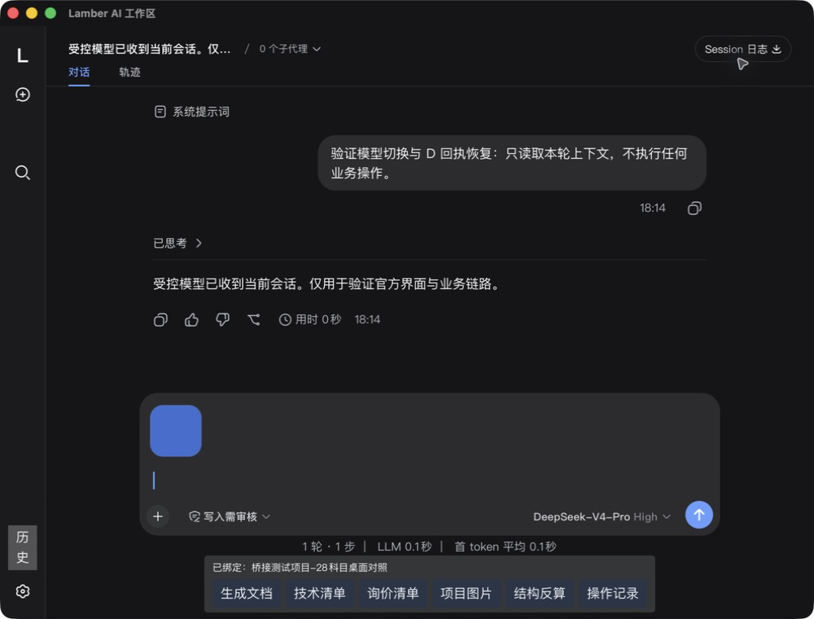
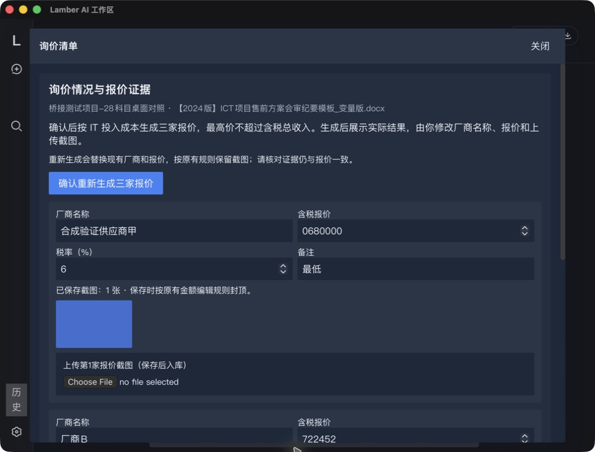
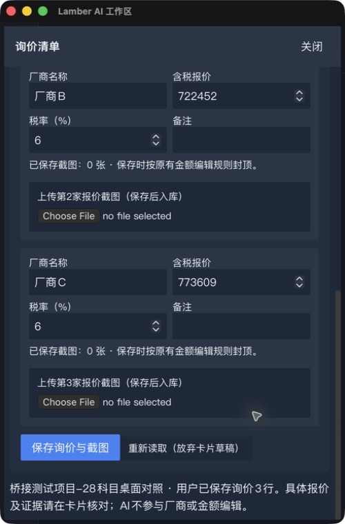
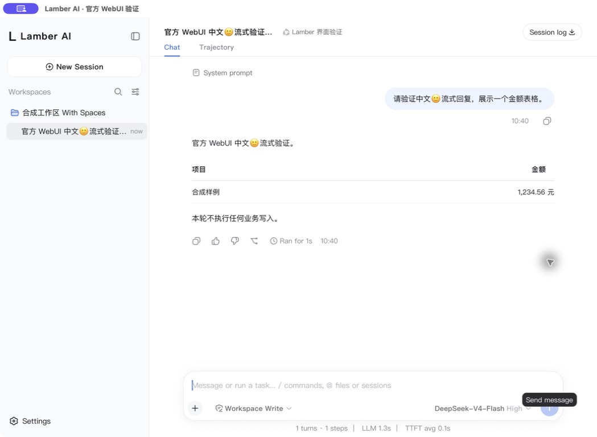
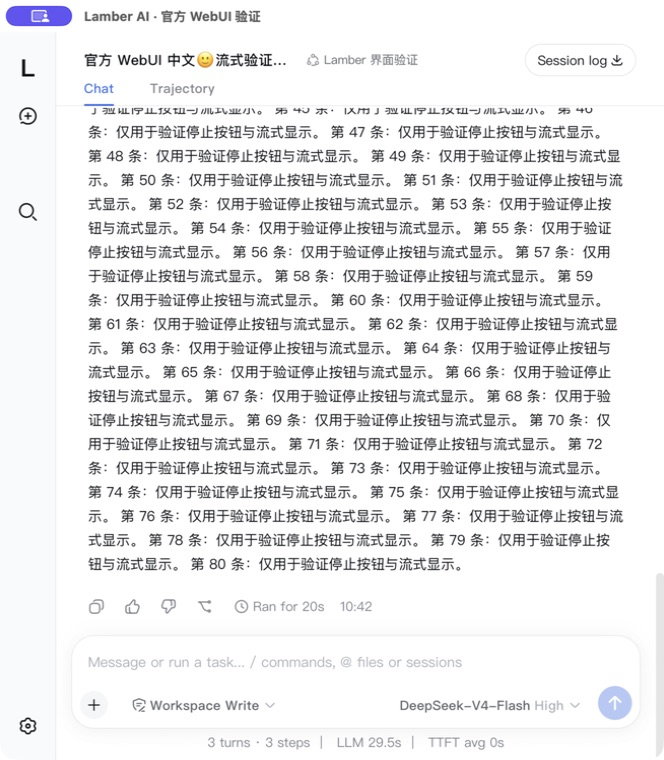
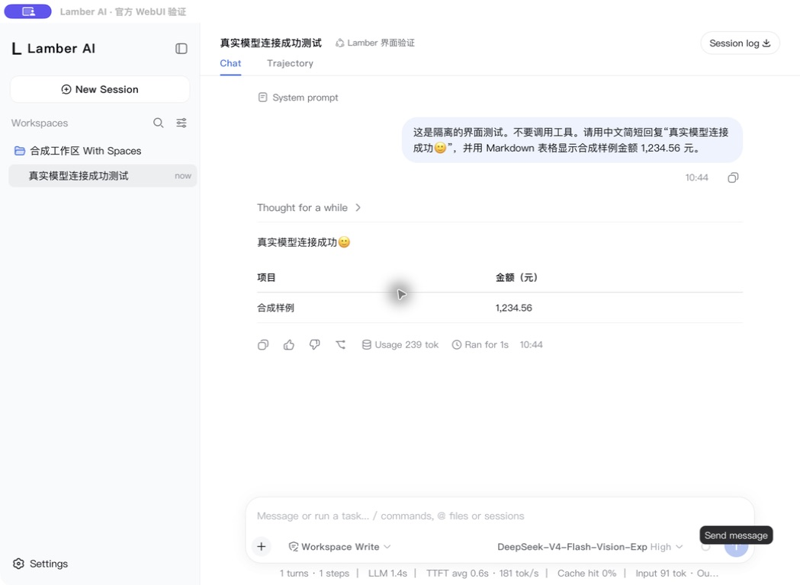

# AI 官方 WebUI 升级：实施与验证

更新：2026-09-10。普通 AI 按钮已直接打开完整 DeepSeek Harness alpha.5 官方 WebUI；旧聊天容器和 ACP 显示双写已移除。正式入口及主要业务闭环已实跑，剩余验收逐项保留，尚不宣称全部 UI/平台验收通过。

## 正式产品入口实跑

使用独立 `com.cmcc.benefitcalc.webui-test` 应用、合成工作区、包内 Node/运行资源，通过主窗口普通 AI 按钮进入。业务问答使用本地受控模型，以下结果不是供应商模型验收。原真实业务数据库与真实配置未写入。

| 场景 | 已核对结果 |
| --- | --- |
| 入口与完整界面 | 官方 boot graph、会话栏、输入、消息、工具/轨迹、附件与设置实际加载；Lamber 仅提供品牌及业务插槽 |
| 新建及绑定 | 用户明确选项目；Rust 固定 dsh 身份与工作区/项目，首轮前未绑定不得执行业务 |
| 改文及 Word | 实际读取需求表 → 原可编辑审批中改文并批准 → 原模板页核对 → 原生成器输出 Word，解包正文与人工定稿一致 |
| 拒绝、停止、关闭 | 审核拒绝、停止本轮、关闭待审批窗口均拒绝；五张模板相关表与各次基准完全一致，原审计记录可查 |
| 工作区切换 | 主窗口实际切换合成工作区，审批立即拒绝并写原工作区审计，新工作区审计表不变；五张原模板相关表零改动，旧端口关闭，新工作区原历史/绑定可打开 |
| 历史冷恢复 | 两轮独立 read/fill 调用后关闭 Host，经普通 AI 按钮重开，原文、四次工具调用、绑定直接恢复，无需切换视图 |
| 旧历史 | 保留原文/源摘要及只读索引；可信后端映射恢复原 dsh ID；伪造前端映射不能授权；缺图只显示元数据；损坏源保留备份并提示 |
| 技术清单 | 用户保存一行，需求导入表与会审纪要共享 `techItems` 一致 |
| 图片 | 用户上传、已存图读取、新旧并排预览；明确确认后事务替换红→蓝；取消不写；首轮前也可附入官方输入框 |
| 询价 | 原生成器按既有精确甄选后合成方案生成678000/722452/773609；人工改第一家名称与金额680000、保存蓝图，原会审商务页与SQLite逐项一致，截图文件实际存在。原28科目甄选前方案的三项1分尾差被原校验拦截，未绕过 |
| D 独立验收 | 目标20.0050%/实际20.0000%，超范围拒绝；确认只改编辑器；手动保存新版v4与原桌面同基准v6输入/输出一致，仅四个计划时间戳不同。28科目及10年计划保留，第四年尾差3885.57/9629.43。见[独立证据](./ai-webui-D-evidence.json) |
| 设置 | 官方设置中的 Lamber 配置复用原密钥/模型服务；保存重启，新请求确认使用Pro与当前上下文；当前会话模型和全局默认区别明确；无打开配置文件或绕过部署权限入口 |
| 视觉 | 官方宽/窄原生承载；正式业务工具栏深色16px实测；500px宽询价面板内部滚动与保存/关闭可达；修复背景误用非官方token造成白底浅字 |
| 系统图片粘贴 | 从macOS预览复制合成PNG，Cmd+V进入官方输入框，待发送缩略图实际可见；未发送，随后移除 |
| 包内启动 | 中文及空格路径，移除开发环境变量且PATH不含Node/npm，普通按钮启动成功；仅macOS资源验证，不等同Windows NSIS |
| 开发启动 | `npm run tauri dev` 实际编译并启动；主入口单次生成Tauri Context，消除macOS `_EMBED_INFO_PLIST` 重定义 |

受控模型的工具调用 ID 必须跨轮唯一。曾复用 ID 的合成日志触发官方轨迹重复起点错误，不能当成有效恢复样本；修正夹具后以新会话重跑，未修改官方渲染器或上游依赖。

正式产品结构化证据见[产品验收记录](./ai-webui-product-evidence.json)。询价验证中的原生方案切换新增甄选前v7，输入/输出与原v6逐项完全一致，未改既有D证据。







## 迁移后职责与实现

| 职责 | 当前实现 |
| --- | --- |
| 活动会话/正文/流/停止/工具/附件 | 官方 Connection、Session Controller 与 ui-session/conversation/chat/tool；删除 `AiChatPanel`、旧输入/气泡/会话组件、`DshRuntime`、`DshMessageProjection`、`useAiSessionStore` |
| 原生窗口与进程 | `aiAssistantWindow` → `ai_open_webui` → `WebUiRuntime`，只允许当前精确回环origin；无通用Tauri IPC暴露 |
| 部署权限 | 停用原Host四行，插入独立gateway/session/workspace/default-model适配；生成自己的client face，浏览器模块与原包逐字节一致，启动验证实际加载标记 |
| 业务上下文 | Host在每轮准入后向主窗口请求；可信绑定、当前真实用户消息、已保存状态、匹配的未保存草稿及持久回执分层提供 |
| 人工改文 | 共享 `ApprovalReview` 保留原文/拟稿对照和编辑；Rust唯一gate和版本/字段复核拥有最终决定 |
| 文档/清单/图片/D | 官方插槽挂共享业务卡片；固定动作API经原主窗口服务执行，原公式、容差、财务保存流程不变 |
| 动作回执 | 原生操作账本先认领再执行，保存实际结果；重连/历史仅读取，D预览令牌不能随历史恢复重放 |
| 旧会话 | 迁移前备份原文、摘要与版本；可信映射恢复原身份，其他只读；旧回执继续进入对应会话上下文 |
| 设置与诊断 | Lamber配置为唯一模型/密钥来源；官方设置只开放部署允许项；AgentLab保留为诊断入口 |

## 自动化验证

- 前端 lint、生产 build、17组前端脚本通过；包含可编辑审批、模板状态、共享上传服务、文档/技术清单/图片/D/财务反算回归。构建保留既有大chunk提示。
- Node部署策略、探针与打包测试通过。真实官方Host集成测试核对实际网关嵌套身份、session/list/follow/control、workspace/follow、设置白名单、外工作区拒绝、三份浏览器模块字节相同及Host退出端口回收。
- Rust常规回归110项通过，23项显式ignored不记通过；新增挂起审批在记录器替换后仍写原数据库的确定性测试。

## 尚未完成的验收


- 完整中文输入法候选、不同字号/DPI、窄窗长审批/业务表格、断网重连和非正常崩溃矩阵尚未全覆盖。
- 本轮正式业务链路缺真实供应商模型复验；阶段0的真实视觉模型承载结果单独保留。当前没有可用真实key，不将受控服务写成真实供应商通过。
- Windows NSIS安装、原Gate 1A密钥保存完整链路及用户真人验收未完成；不发布安装包，不以macOS隔离应用代替这些gate。

## 阶段0独立证据（此前承载验证）

以下记录只证明初始官方承载：受控SSE及真实视觉模型问答/停止续聊、原生宽窄窗口、无cookie API 401及错误Origin 403。它不替代上面的正式业务验收。结构化结果见[阶段0证据](./ai-webui-stage0-evidence.json)。

## 版本与运行边界

`agent-bridge/package-lock.json` 与安装树中 214 个 dsh 包一致，均为 `0.1.2-alpha.5`。专项校验另检查 CLI、Web app、frontend、modules、connection、session controller、chat、approval、theme 九个关键包。

官方 `dist/index.html` SHA-256：`cd1680663a395480e30f15f4ff9676d568b7c05b9c5fc7261535ce7ffe4d6dc2`。静态入口摘要不是整个运行树摘要；完整版本核查由脚本执行。没有自动升级依赖。

验证程序使用临时 DSH_HOME 和含中文、空格的合成目录。它只读取指定配置的 AI 设置，将密钥注入 Host 环境，原生进程不继承模型密钥。Lamber 正式配置、项目数据库和原聊天历史不参与此承载验证。首次探索中曾由官方系统目录选择器登记另一个既有测试目录，未发送模型请求或调用业务工具；最终验证夹具已取消目录选择器，并在模型前强制核对唯一合成 cwd。

`webui_probe.rs` 只在 debug 构建编译，启动分支位于正常应用初始化之前。它使用独立应用标识与 `webui-probe` 窗口标签，清除常规启动窗口、不注册应用命令或插件、不加载工作区，页面无业务 IPC 授权；导航只能留在启动的精确 origin。验证脚本统一回收 Host 和原生应用、删除临时运行目录。该入口不能作为产品默认切换或安装验证证据。

## 可复跑方式

仓库根目录执行：

```sh
cargo build --manifest-path src-tauri/Cargo.toml
python3 scripts/verify-ai-webui.py --output /tmp/lamber-webui-controlled-report.json
```

原生窗口中继续预览说明，在已登记的合成工作区发送中文消息；发送含“长回复”的消息后点停止，再发送消息。拖动窗口右下角验证窄窗；关闭窗口或退出应用后脚本回收进程。默认模型是本机受控 SSE，不能据此声称真实模型通过。

真实模型使用相同程序，显式指定已有配置：

```sh
python3 scripts/verify-ai-webui.py --real --app-config '<app-data>/config.json' --output /tmp/lamber-webui-real-report.json
```

没有密钥会直接报错，不跳过。脚本的 `nativeExitedCleanly` 只表示正常退出，交互验收以本文和截图为准。真实模型测试的正文只含合成样例；不得用该验证入口操作真实业务数据。

## 原生截图






